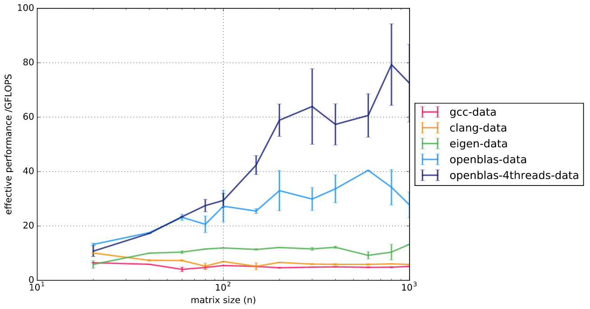

# Results

These are the test cases:

  - **gcc-data**: compile naive blocked algorithm using GCC `-O3`
  - **clang-data**: compile naive blocked algorithm using Clang `-O3`
  - **eigen-data**: use Eigen (single-threaded) compiled using Clang
    `-O3 -march=native`
  - **openblas-data**: use OpenBLAS (single-threaded)
  - **openblas-4threads-data**: use OpenBLAS (4 threads)

These were run on a laptop with Intel i7-4720HQ (2.60 GHz).

